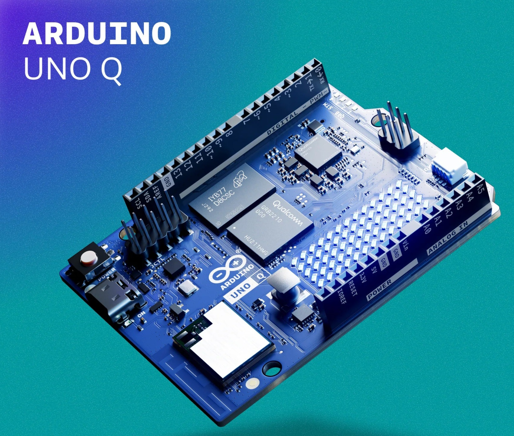

# Arduino-UnoQ-Optimized-Llama-CLI

This repository provides a high-performance LLM inference engine and "Dual-Brain" integration for the **Arduino Uno Q** (Qualcomm QRB2210 + STM32U585).

## 🚀 Performance (SmolLM2-135M)
Optimized on **NVIDIA DGX Spark** (Grace Blackwell) for the **Adreno 702 GPU**.
- **Prompt Processing:** ~59.6 t/s
- **Token Generation:** ~26.2 t/s

## 🧠 Dual-Brain Architecture
This implementation utilizes the Uno Q's unique hybrid design:
1. **MCU (STM32):** Handles real-time sensor data and triggers.
2. **MPU (Qualcomm):** Executes heavy AI reasoning via the optimized `llama-cli`.

## 📂 Repository Structure
- **/mcu**: Arduino sketch for the STM32U585.
- **/mpu**: Optimized `llama-cli` binary and Python orchestrator.
- **/models**: Directory for quantized `.gguf` weights.

## 📥 Getting the Model
The optimized weights are hosted on Hugging Face:
👉 **[Download SmolLM2-135M-Instruct-ArduinoUnoQ-GGUF](https://huggingface.co/assix-research/SmolLM2-135M-Instruct-ArduinoUnoQ-GGUF)**

## 🛠️ Quick Start
1. Flash the sketch in `/mcu` to your Uno Q.
2. Transfer the `/mpu` folder to the Linux side of the board.
3. Download the `.gguf` model into `/mpu/models`.
4. Run the orchestrator:
   ``bash
   python3 mpu/bridge_orchestrator.py
   ``

## License
MIT
